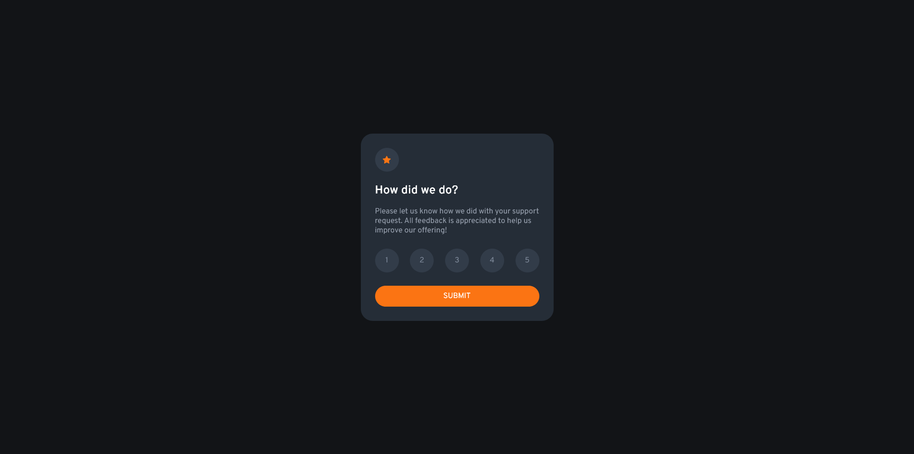

# Frontend Mentor - Interactive rating component solution

This is a solution to the [Interactive rating component challenge on Frontend Mentor](https://www.frontendmentor.io/challenges/interactive-rating-component-koxpeBUmI). Frontend Mentor challenges help you improve your coding skills by building realistic projects. 

## Table of contents

- [Overview](#overview)
  - [The challenge](#the-challenge)
  - [Screenshot](#screenshot)
  - [Links](#links)
- [My process](#my-process)
  - [Built with](#built-with)
  - [What I learned](#what-i-learned)
  - [Continued development](#continued-development)
  - [Useful resources](#useful-resources)
- [Author](#author)

## Overview

### The challenge

Users should be able to:

- View the optimal layout for the app depending on their device's screen size
- See hover states for all interactive elements on the page
- Select and submit a number rating
- See the "Thank you" card state after submitting a rating

### Screenshot



### Links

- Solution URL: [interactive-rating-component repository](https://github.com/Jhannet/interactive-rating-component)
- Live Site URL: [Site on netlify](https://chipper-moxie-86f5ea.netlify.app)

## My process

### Built with

- Semantic HTML5 markup
- CSS custom properties
- Flexbox
- JavaScript
- [JQuery](https://releases.jquery.com/)

### What I learned

I learned to create a layout for a component and to define generic styles for it.\
I learned to use some CSS selectors like :hover :not\
With CSS I learned to create variables and how to use them. I improved to center item with flexbox.

```css
:root {
    --white: hsl(0, 0%, 100%);
    --light-grey: hsl(217, 12%, 63%);
    --medium-grey: hsl(216, 12%, 54%);
    ...
}

.submit-button {
    background-color: var(--orange);
    color: var(--white);
}
```
I learned a way to display and hide elements using JQuery and CSS. 

```js
$("#submit-button").on("click", function(){
    $(".rating-state").toggle();
    $(".thanks-container").toggle();
    $(".rating-result p").text(`You selected ${selectedOption} out of 5`);
});
```

### Continued development

I need to learn or improve:
- Best practices to structure components from scratch
- Create clean components to reuse them
- When to use extra elements for text like p, h1 ...

### Useful resources

- [CSS variables](https://www.w3schools.com/css/css3_variables.asp) - This helped me for learning to create and use variables.
- [Hide and show elements](https://www.w3schools.com/jquery/jquery_hide_show.asp) - JQuery help to hide and show elements

## Author

- Github - [Jhannet Jancko](https://github.com/Jhannet)

